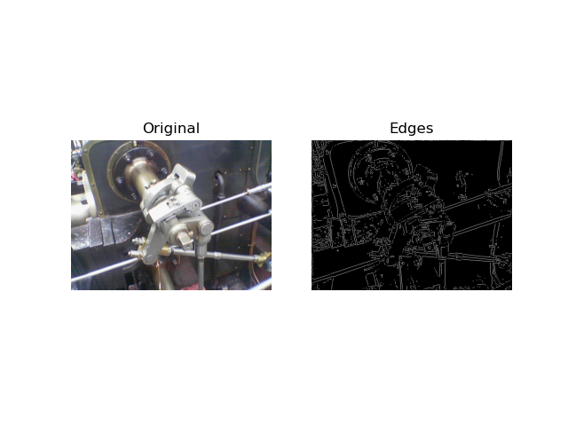

# Canny edge detector (python3)

Implementation of the Canny edge detector in Python3 using numpy, PIL and matplotlib.

###**Quick start**
- Run the script
    ```
     $ python3 edge_detector.py valve.png
    ```
- Output
  